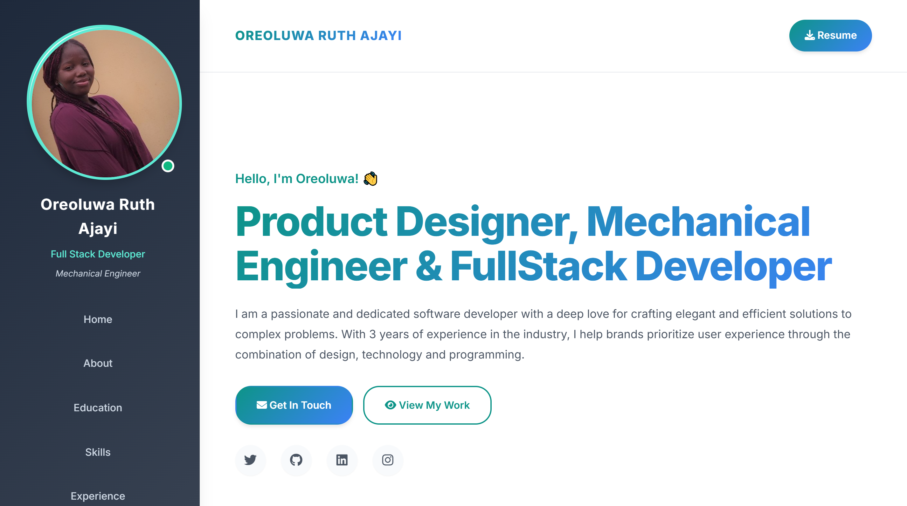
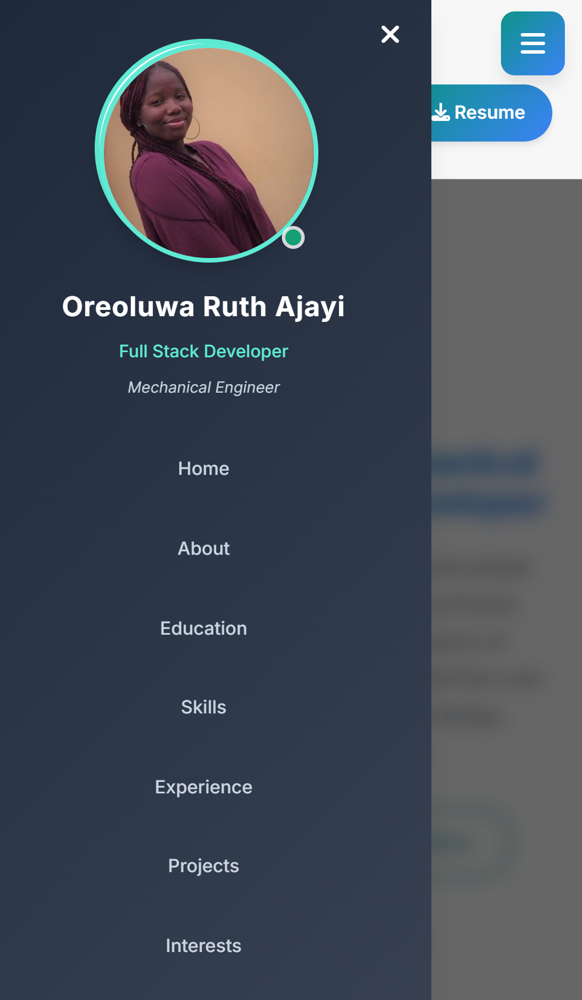
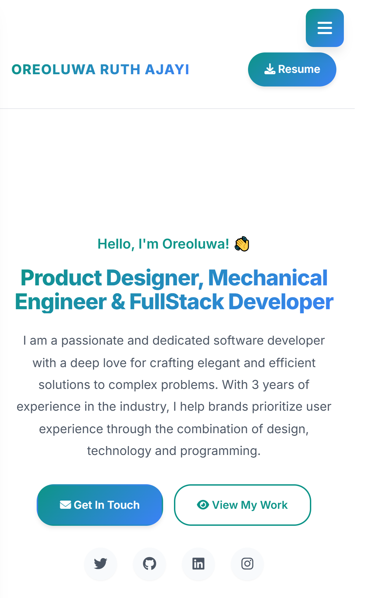

# PLP Academy Portfolio Challenge - July 2025 Cohort

## Oreoluwa Ruth Ajayi - Full Stack Developer & Mechanical Engineer

**Hackathon Submission for PLP Academy Portfolio Challenge**  
**Cohort**: July 2025 | **Submitted by**: Oreoluwa Ruth Ajayi

---

## Live Portfolio

**[View Live Portfolio](https://oreoluwa212.github.io/portfolio)**

Successfully deployed on GitHub Pages as required for the challenge.

### Portfolio Preview




_Desktop and mobile responsive design showcase_

---

## Challenge Requirements Fulfilled

- **Programming Languages** - Showcased proficiency in HTML5, CSS3
- **About Section** - Personal introduction highlighting passion for tech and problem-solving
- **Educational Background** - Bachelor's in Mechanical Engineering with downloadable CV
- **Professional Interests** - Full-stack development, AI integration, and tech advocacy
- **Project Portfolio** - Five live projects with descriptions and demo links
- **Contact Form** - Contact form available for collaboration opportunities

---

## Creativity & Ingenuity (20%)

### Unique Features That Make This Portfolio Stand Out

**Dynamic Wave Animation** - Custom CSS wave effect in hero section creates visual interest  
**Interactive Hover Effects** - Smooth transitions and micro-interactions enhance user engagement  
**Mobile-First Responsive Design** - Seamless experience across all devices with careful breakpoint planning  
**Performance Optimized** - Fast loading with efficient CSS architecture and optimized assets  
**Personal Branding** - Consistent color scheme and typography reflecting professional identity  
**Smooth Scrolling Navigation** - Enhanced user experience using CSS scroll-behavior

### Creative Problem-Solving Approach

- **Challenge**: Create engaging portfolio without JavaScript per hackathon rules
- **Solution**: Leveraged advanced CSS3 features including animations, transforms, and pseudo-elements
- **Innovation**: Used CSS Grid and Flexbox creatively for complex responsive layouts

---

## Code Quality (20%)

### Clean, Readable, and Efficient Code Structure

```css
/* Example of organized CSS structure */
:root {
  --primary-color: #2c3e50;
  --accent-color: #3498db;
  --text-light: #ecf0f1;
  --gradient: linear-gradient(135deg, #667eea 0%, #764ba2 100%);
}
```

**Code Organization Principles:**

- **Semantic HTML5** - Proper use of header, section, article, and nav elements
- **CSS Custom Properties** - Consistent theming system for maintainability
- **Mobile-First Approach** - Progressive enhancement from small to large screens
- **Modular CSS** - Organized sections for easy maintenance and future updates
- **Cross-Browser Compatibility** - Tested across Chrome, Firefox, Safari, and Edge

**Performance Considerations:**

- Lightweight codebase under 50KB total
- Optimized images and assets
- Efficient CSS selectors avoiding unnecessary specificity
- No unused code or dependencies

---

## Documentation (15%)

### Comprehensive Project Documentation

**Code Comments and Structure:**

- Clear section headers throughout CSS file
- Explanatory comments for complex animations and layouts
- Descriptive class and ID naming conventions following BEM methodology

**README Documentation:**

- Step-by-step setup and installation instructions
- Detailed project structure explanation
- Complete technology stack breakdown
- Live demo links with project descriptions
- Professional contact information and social media links

---

## Deployment (15%)

### Successful GitHub Pages Deployment

**Deployment Process:**

1. **Repository Setup** - Created public GitHub repository following best practices
2. **GitHub Pages Configuration** - Enabled Pages in repository settings with proper branch selection
3. **Domain Configuration** - Ready for custom domain implementation if needed
4. **Cross-Platform Testing** - Verified functionality across multiple devices and browsers

**Accessibility and Performance:**

- Portfolio accessible 24/7 with reliable uptime
- Fast loading times with global CDN distribution
- Mobile-responsive design verified on actual devices
- Cross-browser compatibility confirmed across major browsers

**Live URL**: https://oreoluwa212.github.io/portfolio

---

## Development Process (15%)

### Project Management and Collaboration Skills

**Planning and Analysis Phase:**

- Thoroughly analyzed hackathon requirements and evaluation criteria
- Created wireframes and design mockups before development
- Planned responsive breakpoints and feature implementation strategy

**Development Workflow:**

- Implemented Git version control with meaningful, descriptive commit messages
- Used incremental development approach with regular testing phases

**PLP Academy Integration:**

- Applied skills and concepts learned throughout PLP Academy coursework
- Incorporated collaborative feedback and peer review processes
- Demonstrated continuous learning mindset and adaptation to new challenges

**Project Timeline:**

- Days 1-2: Requirement analysis, planning, wireframing, and initial setup. Core HTML structure development and foundational styling
- Day 3: Advanced CSS features implementation and responsive design
- Day 4: Final testing, optimization, and deployment procedures

---

## Technology Stack Utilization (15%)

### Fundamental Web Development Skills Demonstration

**HTML5 Implementation:**

- Semantic markup ensuring accessibility and SEO optimization
- Proper document structure with appropriate metadata
- Form elements using correct input types and validation attributes
- Structured data hierarchy with meaningful content organization

**CSS3 Advanced Features:**

- **Flexbox and CSS Grid** - Modern layout techniques for complex designs
- **Custom Properties** - Maintainable theming system with consistent variables
- **Animations and Transitions** - Engaging user interactions without JavaScript
- **Media Queries** - Comprehensive responsive design implementation
- **Pseudo-elements** - Creative visual effects achieved without additional markup

**Raw HTML/CSS Approach:**

- No external frameworks used, adhering to hackathon requirements
- Demonstrates thorough understanding of fundamental web technologies
- Showcases ability to build complex interfaces from scratch
- Proves mastery of core web development principles

---

## Featured Projects Portfolio

### Project Showcase

1. **Delve - Language Learning App**

   - Interactive 3D features implemented with Three.js
   - Voice recognition integration for pronunciation practice
   - Live Demo: [delve.fun](https://delve.fun)

2. **Life Plus Web App**

   - Comprehensive personal development platform
   - React-based architecture with modern component design
   - Live Demo: [life-plus-webapp.vercel.app](https://life-plus-webapp.vercel.app/)

3. **Online Clothing Store**

   - Full-featured e-commerce platform with shopping cart functionality
   - Next.js implementation with external API integration
   - Live Demo: [store-clothing.vercel.app](https://store-clothing.vercel.app)

4. **TaskMe AI**

   - AI-powered project management and task breakdown tool
   - Intelligent task organization and priority management
   - Live Demo: [task-me-ai.vercel.app](https://task-me-ai.vercel.app)

5. **StreamVibe - Movie Platform**
   - Netflix-inspired movie recommendation platform
   - TMDB API integration with comprehensive movie database
   - Live Demo: [stream-vibe-ebon.vercel.app](https://stream-vibe-ebon.vercel.app)

---

## About Oreoluwa Ruth Ajayi

**PLP Academy July 2025 Cohort Member**

I am a passionate Full Stack Developer and Mechanical Engineer with a unique combination of technical engineering background and modern web development expertise. My participation in PLP Academy has significantly strengthened my foundation in web technologies and collaborative development methodologies.

### Professional Experience

- **Student Fellow** at Tech4Dev - Providing mentorship in React.js and Next.js development
- **Tech Girls Advocacy Drive State Head** - Led STEM outreach programs reaching over 1000 young women
- **Software Engineer Intern** at alx_africa - Full-stack development with modern frameworks
- **React Developer Intern** at HerTechTrail - Specialized in event ticketing system development

### Educational Background

**Bachelor of Engineering** - Mechanical Engineering  
University of Ibadan (2018 - 2024)

**Current Program**: PLP Academy July 2025 Cohort - Advanced Web Development Track

---

## Contact and Collaboration

Available for new opportunities and collaborative projects.

- **Email**: oreoluwaajayyiruth@gmail.com
- **LinkedIn**: [oreoluwa ajayi](https://www.linkedin.com/in/oreoluwaajayi)
- **GitHub**: [oreoluwa212](https://github.com/oreoluwa212)
- **Twitter**: [oreoluwa_ruth](https://twitter.com/oreoluwa_ruth)

**Direct Contact**: Contact form available on live portfolio for immediate inquiries

---

## Hackathon Submission Information

**Challenge**: PLP Academy Portfolio Challenge - July 2025 Cohort  
**Submission Date**: August 2025  
**Repository Type**: Public GitHub repository  
**Deployment Platform**: GitHub Pages  
**Requirements Status**: All criteria successfully fulfilled

Built with dedication for the PLP Academy learning community.

---

## Project Structure

```
portfolio/
├── index.html              # Main HTML file with semantic structure
├── style.css               # Comprehensive CSS with custom properties
├── public/                 # Optimized image assets directory
│   ├── web1.png           # Project screenshot examples
│   ├── portfolio-preview.png # README preview screenshot
│   └── ...
└── README.md               # Comprehensive project documentation
```

---

## Setup and Installation Instructions

1. **Repository Cloning**

   ```bash
   git clone https://github.com/oreoluwa212/portfolio.git
   cd portfolio
   ```

2. **Live Server Extension Setup**

   - Open project folder in Visual Studio Code
   - Install "Live Server" extension by Ritwick Dey from VS Code marketplace
   - Right-click on index.html file
   - Select "Open with Live Server" from context menu
   - Portfolio will automatically launch in default browser

3. **Alternative Opening Method**
   - Double-click index.html file to open directly in browser
   - Note: Live Server provides optimal experience for all features

---

## License

This project is open source and available under the MIT License.

---

**Thank you to PLP Academy July 2025 Cohort**  
This portfolio represents my growth and commitment as a dedicated member of this learning community.

**Developed by Oreoluwa Ruth Ajayi**  
Full Stack Developer | Mechanical Engineer | Tech Advocate | PLP Academy Student
